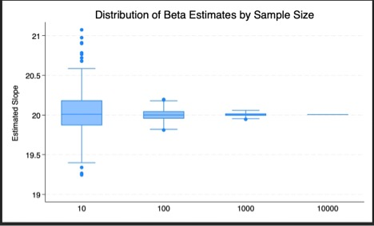

# STATA_3 
## Part 1: Q6 - Results Description 
For this exercise, I generated the random, normally distributed independent variable study time (mean: 8 hours per week, sd: 3 hours per week) and the dependent variable SAT score (mean: 1160, sd: 61). The relationship between these variables is defined as follows: Y = 1000 + 20x1) + error. Using the simulate function, I ran a bi-variate regression 500 times at samples 10, 100, 1,000, and 10,000. The total observations of this dataset is 10,000. 
\
\
\
\
\
\
 \
The box plot above presents the estimated slope of the beta coefficients for study time over increasing sample sizes. Values are more clustered around the mean slope, 20, with a wider distribution towards the origin. As expected, the variation in the effect of study time on SAT scores decreases the sample size increases. 
\
\
 \
[Pasted Graphic 1.pdf](https://github.com/user-attachments/files/19529413/Pasted.Graphic.1.pdf)\
\
\
\
The box table above presents the average coefficients for study time, standard error of the mean, the range of the 95% confidence interval, and standard deviation by sample size. Each statistic becomes more conservative as the sample size increases because the larger the sample the higher the accuracy of our estimates. 
\
\
## Part 2: Q6 - Results Description 
\
Using the same data generating process, I replicated the simulation regression process for sample sizes corresponding to the first twenty powers of two and at N = 10, 100, 1,000, 10,000, 100,000, and 1,000,000. 
 \
[Pasted Graphic 4.pdf](https://github.com/user-attachments/files/19529414/Pasted.Graphic.4.pdf)

\
[Pasted Graphic 3.pdf](https://github.com/user-attachments/files/19529415/Pasted.Graphic.3.pdf)

\
 \
\
Like the results of Part 1, our statistics become more precise as the sample size increases. The standard error of the mean is also getting smaller, accounting for the accuracy that comes with larger sample sizes according to the central limit theorem. While the graph and visual above do not capture the statistics of every sample size, the lesson is clear: the power of our regression increases as the sample size increases allowing us to better decide true effects of the independent variable on the outcome. 

